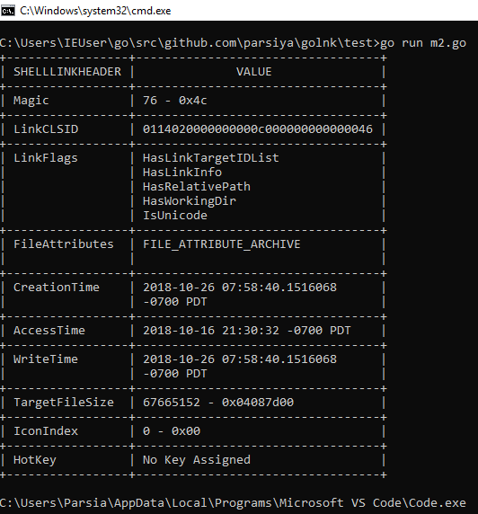
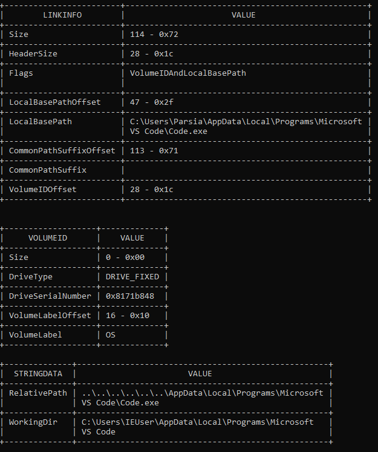
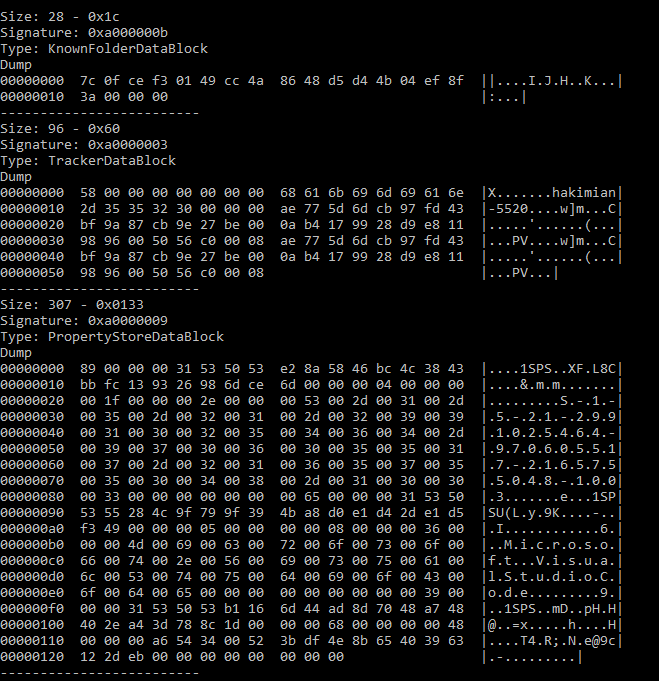

# lnk - lnk Parser for Go
lnk is a package for parsing Windows Shell Link (.lnk) files.

It's based on version 5.0 of the [MS-SHLLINK] document:

* Reference: https://msdn.microsoft.com/en-us/library/dd871305.aspx
* Version 5.0: https://winprotocoldoc.blob.core.windows.net/productionwindowsarchives/MS-SHLLINK/[MS-SHLLINK].pdf

If the lnk file does not adhere to this specification (either corrupted or from an earlier version), it might not be parsed.

## Shell Link Structure
Each file has at least one header (`SHELL_LINK_HEADER`) and one or more optional sections. The existence of these sections are defined by the `LinkFlags` uint32 in the header.

```
SHELL_LINK = SHELL_LINK_HEADER [LINKTARGET_IDLIST] [LINKINFO]
              [STRING_DATA] *EXTRA_DATA
```

Note: "Unless otherwise specified, the value contained by size fields includes the size of size field itself."

Currently lnk parses every section except `EXTRA_DATA`. Different data blocks are identified and stored but it does not parse any of them other than identifying the type (via their signature) and storing the content. Data blocks are defined in section 2.5 of the specification.

## Setup
Package only one dependency (for stringer methods): https://github.com/olekukonko/tablewriter.

## Usage
Pass a filename to `lnk.File` or an `io.Reader` with contents to `lnk.Read`. Both return `LnkFile`:

``` go
type LnkFile struct {
	Header     ShellLinkHeader   // File header.
	IDList     LinkTargetIDList  // LinkTargetIDList.
	LinkInfo   LinkInfoSection   // LinkInfo.
	StringData StringDataSection // StringData.
	DataBlocks ExtraData         // ExtraData blocks.
}
```

Each section is a struct that is populated. See their fields in their respective source files.

``` go
package main

import (
	"fmt"

	"github.com/parsiya/golnk"
)

func main() {

	Lnk, err := lnk.File("test.lnk")
	if err != nil {
		panic(err)
	}

	// Print header.
	fmt.Println(Lnk.Header)

	// Path to the target file is usually in LinkInfo.LocalBasePath.
	fmt.Println("BasePath", Lnk.LinkInfo.LocalBasePath)

	// fmt.Println(Lnk.LinkInfo)

	// fmt.Println(Lnk.StringData)

	// fmt.Println(Lnk.DataBlocks)
}
```



Each section has a [Stringer](https://golang.org/pkg/fmt/#Stringer) that prints the fields in a [table](https://github.com/olekukonko/tablewriter).



Extra Data Blocks are not parsed but can be dumped or accessed manually.



## TODO
1. Use `dep`?
2. Identify ExtraDataBlocks.
3. Clean up code.
4. Write more unit tests.
5. Test it on more lnk files.
